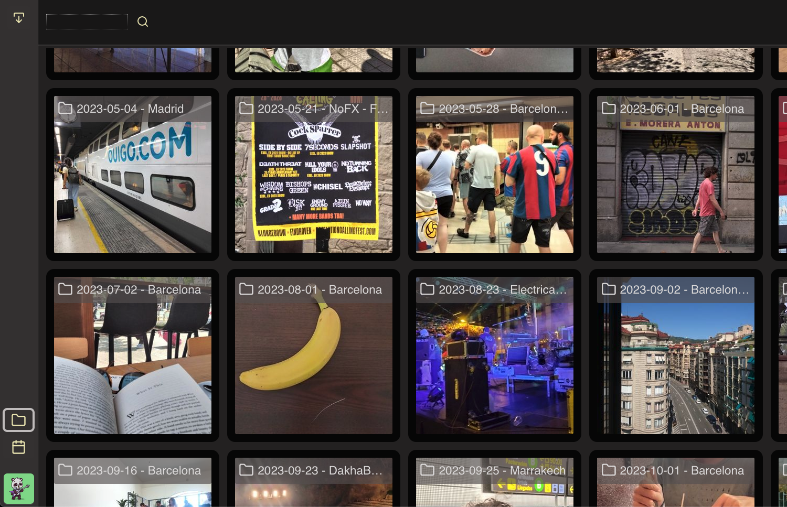
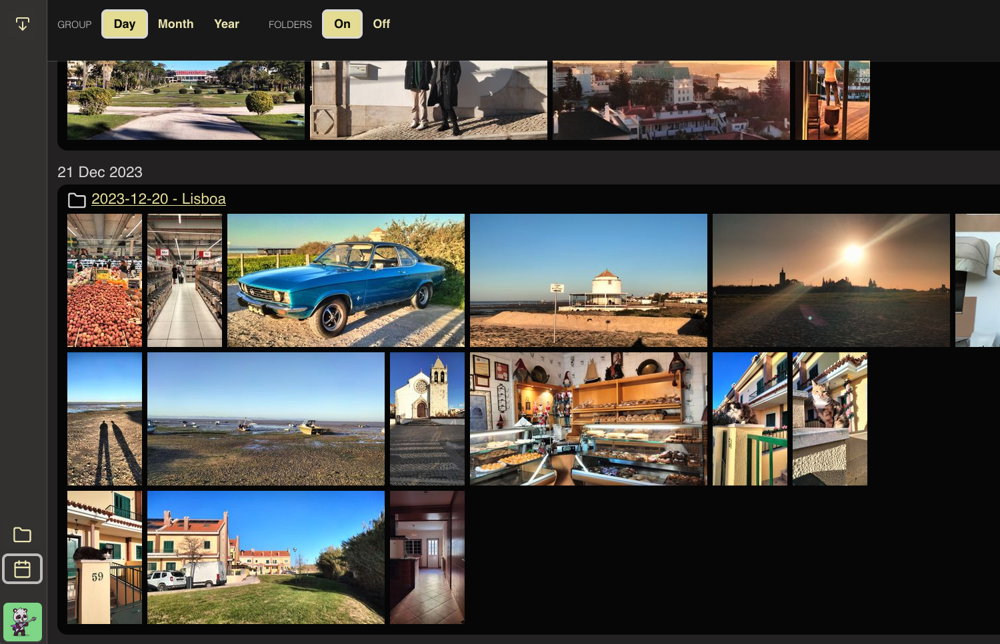

# Mr. Noodles

> A bespoke media center browser app

- multiple users
- multiple folders per user
- explore media by folders
- browse by timeline
- TODO video
- TODO playlists
- TODO idle mode
- TODO guests

| Folders View                                         | Timeline View                                         |
| ---------------------------------------------------- | ----------------------------------------------------- |
|  |  |

## FAQ:

### What do you use it for?

I mostly use it to browse my collection of photos and videos when at home.

- saves money (no expensive photo cloud account)
- images and videos load blazing fast on phones, tablets, and the living room projector
- we know where the pictures are (meaning old school folders)
- and we can organize them however we want
- the whole family (and visitors) can browse and share media

### Why did you create it?

I used to have a Google Photos payed account but got tired of paying to wait for images and videos to load.

So I downgraded to a 15GB Google account where I keep only the most recent media and a curated album of older (or timeless) things I might want to share with others when not at home.

As for the actual treasure chest, I keep it in a media server on the living room, properly backed up, of course.

### Can I run it on my own media server?

Sure, at your own peril.

This software uses a filesystem database to store metadata about the server's managed folders and media files. These files will be located alongside the files (think `._DS_Store` kind of files, but called `.<something>.noodle.json`)

The system is also capable of removing these files. "Supposedly" it never touches the original media files, only metadata files and compressed thumbnails. But, who knows ... this thing is not properly tested.

### Is there an installation guide?

Not yet.

But it will be something along the lines of:

- Install NodeJS
- Clone this repository
- Create an `.env` file based on [.env.example](./.env.example)
- Launch the [Server](./packages/server/README.md)
- Launch the [Client APP](./packages/client/apps/app-noodles-gallery/README.md)

### Can the Server & Client restart when the media server reboots?

Sure!

I used [Supervisord](http://supervisord.org/). Easy to setup and works flawlessly.

### Will it run on windows?

Sure? ... Not sure :-D I tested it a few months ago and it was working but I don't test it regularly.

### Can I expose the server to the internet?

Sure. Also at your own peril.

And you'll have to wire it all up yourself.

### What is Noodlestan?

It is our realm. Welcome, you are invited.

## Development

Recommended software:

- [NVM](https://github.com/nvm-sh/nvm)
- [VS Code](https://code.visualstudio.com/)
- [VS Code ESLint](https://marketplace.visualstudio.com/items?itemName=dbaeumer.vscode-eslint)
- [VS Code Prettier](https://marketplace.visualstudio.com/items?itemName=esbenp.prettier-vscode)

### What's in the repo

This Monorepo hosts all code for Mr. Noodles.

See each package's README for more details.

- [Server](./packages/server/README.md)
- [Client APP](./packages/client/apps/app-noodles-gallery/README.md)
- [Client UI lib home](./packages/client/apps/app-ui-system/README.md)
- [Client UI lib packages](./packages/client/libs/)
- [Shared libs](./packages/shared/types/README.md)

### Committing

[Lefthook](https://evilmartians.com/chronicles/lefthook-knock-your-teams-code-back-into-shape) should run automatically before every commit.

- lints all code
- does a global `tsc` compilation
- builds shared code
- builds server(s)
- builds client app(s)

**Note:** if you encounter `🥊 lint` errors you should run `npm run lint` for details (linting is silent because `prettier` is noisy and breaks Lefthook's output buffering)

## License

Copyright (c) 2023 [Andre Torgal](https://andretorgal.com/).

Published under a [MIT License](https://andrezero.mit-license.org/2023).
